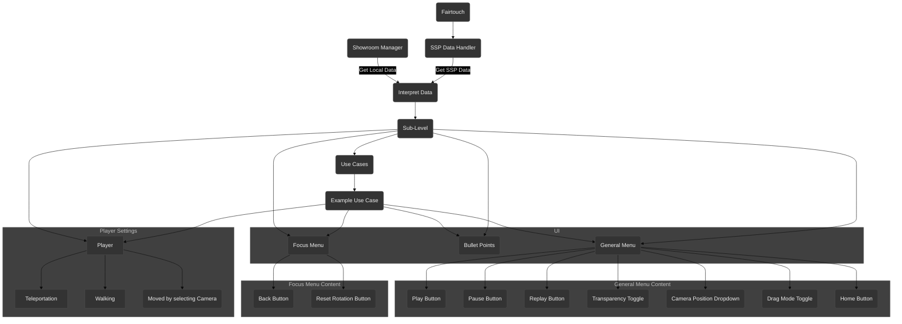

# B12 Showroom System

Welcome to the B12 Showroom System Documentation!

```mermaid
%%{init: {'theme': 'base', 'themeVariables': { 'primaryColor': '#333333', 'darkMode' : 'true', 'defaultLinkColor' : '#000000'}}}%%

  

graph TD

ShowroomManager(Showroom Manager)

-->|Get Local Data| Data(Interpret Data)

Fairtouch(Fairtouch)

-->SSPDataHandler(SSP Data Handler)

SSPDataHandler

-->|Get SSP Data| Data(Interpret Data)

Data

--> SubLevel(Sub-Level)

  

SubLevel

--> UseCases(Use Cases)

SubLevel

--> Player

  

UseCases

--> UseCaseExample(Example Use Case)

UseCaseExample

--> GeneralMenu

UseCaseExample

--> Player

UseCaseExample

--> BulletPoints

  

SubLevel

--> GeneralMenu(General Menu)

SubLevel

--> FocusMenu(Focus Menu)

SubLevel

--> BulletPoints(Bullet Points)

  

Player

--> Teleportation

Player

--> Walking

Player

--> Moved(Moved by selecting Camera)

GeneralMenu

--> PlayButton

GeneralMenu

--> PauseButton

GeneralMenu

--> ReplayButton

GeneralMenu

--> ToggleTransparency

GeneralMenu

--> CameraPosDropdown

GeneralMenu

--> ToggleDragMode

GeneralMenu

--> HomeButton

  

FocusMenu

--> BackButton

FocusMenu

--> ResetRotationButton

  

UseCaseExample

--> FocusMenu

  

subgraph Player Settings

  

Player

Teleportation

Walking

Moved

  

end

  

subgraph UI

  

GeneralMenu

FocusMenu

BulletPoints

  

end

  

subgraph General Menu Content

  

GeneralMenu

PlayButton(Play Button)

PauseButton(Pause Button)

ReplayButton(Replay Button)

ToggleTransparency(Transparency Toggle)

CameraPosDropdown(Camera Position Dropdown)

ToggleDragMode(Drag Mode Toggle)

HomeButton(Home Button)

  

end

  

subgraph Focus Menu Content

  

FocusMenu

BackButton(Back Button)

ResetRotationButton(Reset Rotation Button)

  

end
```

